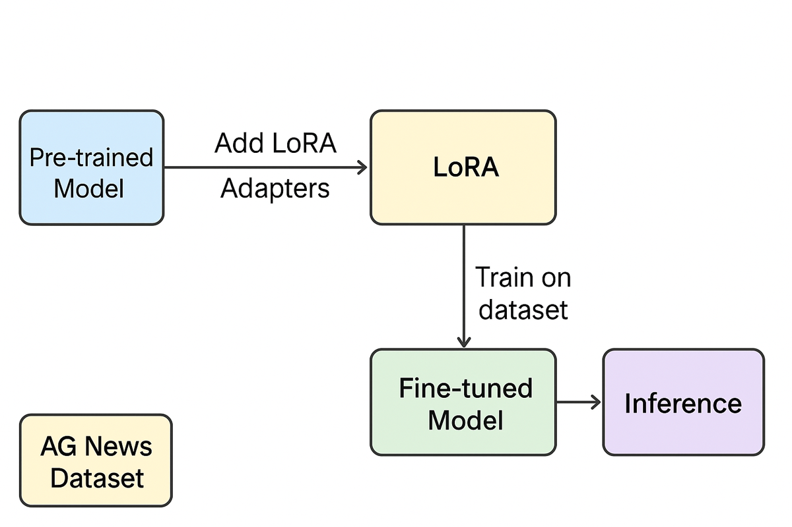

# Project 1 - Apply Lightweight Fine-Tuning to a Foundation Model

This repository showcases my first Udacity Generative AI Nanodegree project. Here, I explore how to apply **LoRA (Low-Rank Adaptation)** to fine-tune a foundation model for text classification, demonstrating an efficient approach to improving model performance. The project is fully runnable in Colab or locally, and is aimed at learners and AI enthusiasts who want a clear, hands-on example of parameter-efficient fine-tuning.

Welcome to my project on applying lightweight fine-tuning techniques to a foundation model! This work is part of the **Udacity Generative AI Nanodegree** and highlights how LoRA can be used to efficiently adapt a DistilBERT model for text classification on the AG News dataset. If you're interested in practical AI model fine-tuning with minimal computational resources, this project is for you.

[](https://colab.research.google.com/github/GemmaLaraSavill/udacity-genai-project1-lora-finetuning/blob/main/Project1_LoRA_FineTuning.ipynb)

The results speak for themselves: while the base model performs at around 22% accuracy (close to random chance), applying LoRA adapters boosts accuracy to approximately 90%. This demonstrates the power of parameter-efficient fine-tuning techniques in practice.

------------------------------------------------------------------------

## 🚀 Project Overview

- **Base model**: `distilbert-base-uncased`
- **Dataset**: AG News (4 classes: World, Sports, Business, Sci/Tech)
- **Fine-tuning method**: LoRA (Lightweight adapters)
- **Goal**: Improve classification accuracy while keeping training efficient.

------------------------------------------------------------------------

## 📊 Training Pipeline



1. Load dataset (AG News)  
2. Load DistilBERT base model  
3. Apply LoRA adapters (trainable, small parameter set)  
4. Fine-tune on AG News  
5. Evaluate base vs LoRA models  
6. Save and reload trained model

------------------------------------------------------------------------

## 📈 Example Results

- **Base Model Accuracy**: ~22% (random-like performance)  
- **LoRA Fine-Tuned Model Accuracy**: ~90%

Example inference:

```python
from transformers import pipeline

# Load fine-tuned LoRA model pipeline
classifier = pipeline("text-classification", model="path_to_finetuned_lora_model")

text = "The stock market showed significant gains today after positive earnings reports."
result = classifier(text)
print(result)
```

------------------------------------------------------------------------

## 💻 Installation

To run this project locally, please follow these steps:

1. Clone the repository:

```bash
git clone https://github.com/GemmaLaraSavill/udacity-genai-project1-lora-finetuning.git
cd udacity-genai-project1-lora-finetuning
```

2. Create and activate a virtual environment (optional but recommended):

```bash
python3 -m venv venv
source venv/bin/activate  # On Windows use `venv\Scripts\activate`
```

3. Install dependencies:

```bash
pip install -r requirements.txt
```

------------------------------------------------------------------------

## ▶️ Running the Notebook

You can run the project notebook directly in Google Colab by clicking the badge above or run it locally:

```bash
jupyter notebook Project1_LoRA_FineTuning.ipynb
```

Follow the notebook instructions to fine-tune the model and evaluate performance.

------------------------------------------------------------------------

## 📁 Project Structure

```
├── Project1_LoRA_FineTuning.ipynb  # Main project notebook
├── requirements.txt                 # Python dependencies
├── diagram.png                     # Training pipeline diagram
├── README.md                       # This file
└── lora_ag_news/                   # Directory created locally when the fine-tuned model is saved (not included in repo)
```

------------------------------------------------------------------------

## 📋 Requirements

- Python 3.7+
- PyTorch
- Transformers
- Datasets
- PEFT (Parameter-Efficient Fine-Tuning)
- Other dependencies listed in `requirements.txt`

------------------------------------------------------------------------

## 📚 References

- [LoRA: Low-Rank Adaptation of Large Language Models](https://arxiv.org/abs/2106.09685)
- [Hugging Face Transformers](https://huggingface.co/transformers/)
- [AG News Dataset](https://huggingface.co/datasets/ag_news)
- [Udacity Generative AI Nanodegree](https://www.udacity.com/course/generative-ai-nanodegree--nd348)

------------------------------------------------------------------------

## 📝 Blog Post

Read the full blog post here: 